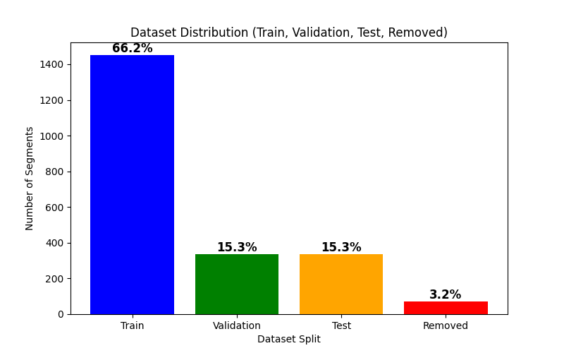
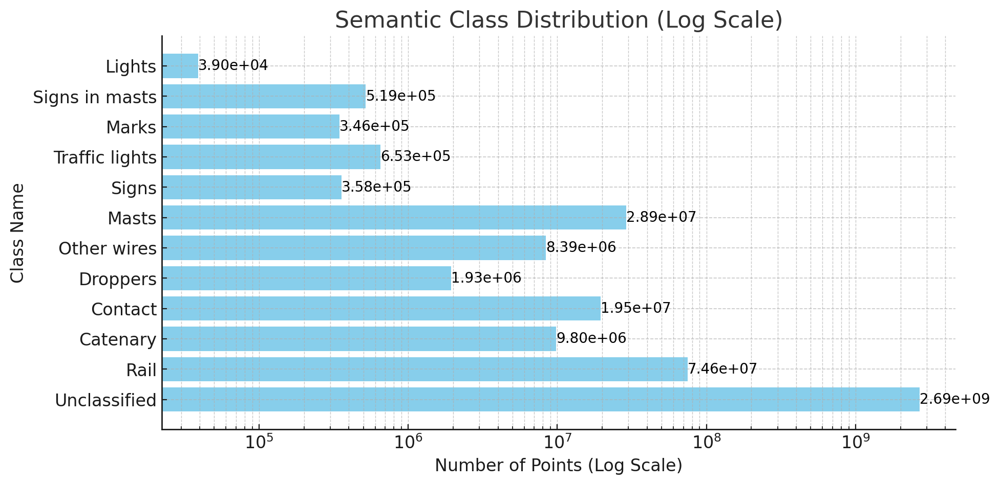

# 📌 SemanticRail3D_Dataset
This repository contains the SemanticRail3D dataset, a high-quality 3D point cloud dataset for railway infrastructure segmentation and classification. It consists of 438 point clouds, each covering 200 meters of track, totaling 2.8 billion points labeled into 11 semantic classes. The dataset is structured for machine learning applications, with train, validation, and test splits.

# 🔹 Key Features:
✔ High-resolution LiDAR data (980 points/m², 5mm precision)

✔ Semantic segmentation (11 classes) & instance segmentation

✔ Preprocessed with normal vectors, intensity, and additional features

✔ Structured in NumPy format for easy loading

🚀 Use this dataset for developing AI models in railway point cloud analysis! 🚀


## Introduction

The segmentation and classification of 3D point clouds in railway infrastructures present significant challenges in both scientific research and technological applications. One major difficulty is the limited availability of large, high-quality datasets that enable the training of AI models for point cloud segmentation and classification. Furthermore, the field lacks benchmarks that allow for objective comparison of different approaches, making it difficult to track progress and develop improved solutions.

The SemanticRail3D dataset aims to bridge this gap by offering a comprehensive benchmark for the scientific community. This dataset provides detailed 3D point cloud labels of railway environments, facilitating the development and evaluation of segmentation and classification models. With this dataset, researchers now have a common reference for comparing results, improving methodologies, and advancing state-of-the-art machine learning techniques for railway infrastructure analysis.

## Dataset Overview
The SemanticRail3D dataset consists of 438 point clouds, each covering approximately 200 meters of railway track. The dataset contains a total of 2.8 billion points, with 11 different classes labeled for semantic segmentation. Additionally, track position for each railway line is provided, along with instance segmentation to distinguish between different objects in the scene.

 ## Data Acquisition
The dataset was collected using a LYNX Mobile Mapper by Optech, which employs two LiDAR sensors mounted on a Mobile Mapping System (MMS). The average point cloud density is 980 points/m², with a range precision of 5 mm, ensuring high-quality spatial representation.

## Data Attributes
Each point cloud includes the following attributes:

XYZ Coordinates: Provided in a local coordinate system, ensuring positive values (minimum coordinate value is 0).

Intensity: Encoded in 12-bit format (0-4096), indicating surface reflectivity.

Time Stamp: Time at which each point was captured.

Return Number: Identifies whether the point corresponds to the first, second, third, etc., return of a LiDAR pulse.

Number of Returns: Specifies the total number of returns detected from a single laser pulse.

Scan Angle: The inclination angle of the LiDAR sensor when capturing the point.

## 📂 Dataset Splits

- 📝 **[Train Cloud Segments](Data_Info/train_clouds.txt)** → Clouds and their respective segment numbers.
  
- 📝 **[Validation Cloud Segments](Data_Info/val_clouds.txt)** → Clouds and their respective segment numbers.
  
- 📝 **[Test Cloud Segments](Data_Info/test_clouds.txt)** → Clouds and their respective segment numbers.
  
- 🗑 **[Removed Cloud Segments](Data_Info/removed_clouds.txt)** → List of removed clouds with missing segments.
  
📊 Dataset Distribution
The dataset consists of 437 point clouds, each divided into 5 segments, totaling 2,185 segments.
Some segments were removed due to issues such as mislabeling, errors in labels, or incorrect class assignments.
The remaining data was split into Train, Validation, and Test sets to be used for machine learning approaches.

📌 Static Chart
Below is the dataset distribution after preprocessing and splitting:



📈 Interactive Chart
For a detailed interactive version, click the link below:

📊 **[View Interactive Chart](Data_Info/dataset_distribution.svg)**

# 📂 Dataset Structure

The dataset is organized as follows:
```plaintext
SemanticRail3D/
                ├── train_part1/
                │   ├── cloudXXX_SegY.laz
                │   ├── cloudXXX_SegY.laz
                │   ├── ...
                ├── train_part2/
                ├── train_part3/
                ├── train_part4/
                ├── train_part5/
                │
                ├── Validation/
                │   ├── cloudXXX_SegY.laz
                │   ├── ...
                │
                ├── Test/
                │   ├── cloudXXX_SegY.laz
                │   ├── ...
```

______________________________________________________
📌 Available Attributes per Point in .laz Files
Each .laz file contains the following attributes for every point:

x, y, z: 3D spatial coordinates

intensity: Return intensity from LiDAR sensor

class: Semantic segmentation label (integer ID of the object class)

instance_id: Instance segmentation label (ID representing individual object instances)
______________________________________________________
## 📌 Semantic Class Distribution (Log Scale)

The dataset contains **11 labeled classes**. Since the class counts vary significantly, we use a **log scale** for better visualization.  
Below, you can see the **exact number of points** in each class.




# 📌 Citation and Related Works for SemanticRail3D Dataset
If you use the SemanticRail3D dataset in your research, please cite it as follows:

### 📌 Citation
The SemanticRail3D dataset is published on Zenodo and can be cited using the following DOI:

🔗 10.5281/zenodo.11143766

```plaintext
@dataset{SemanticRail3D,
  author = {[Author Names]},
  title = {SemanticRail3D: A Benchmark Dataset for Railway Infrastructure Segmentation},
  year = {2024},
  version = {v0},
  doi = {10.5281/zenodo.11143766},
  publisher = {Zenodo}
}
```
----------------------

### 📌 Related Works
The SemanticRail3D dataset is derived from and referenced by the following journal articles:

### 📌 Derived From
📄 Journal Article:
Remote Sensing, DOI: 10.3390/rs13122332
Title: Railway Infrastructure Inspection Using Mobile LiDAR and Deep Learning Models

### 📌 Referenced By
📄 Journal Article:
Automation in Construction, DOI: 10.1016/j.autcon.2023.104854
Title: Machine Learning-Based Automated Processing of Railway Point Clouds


