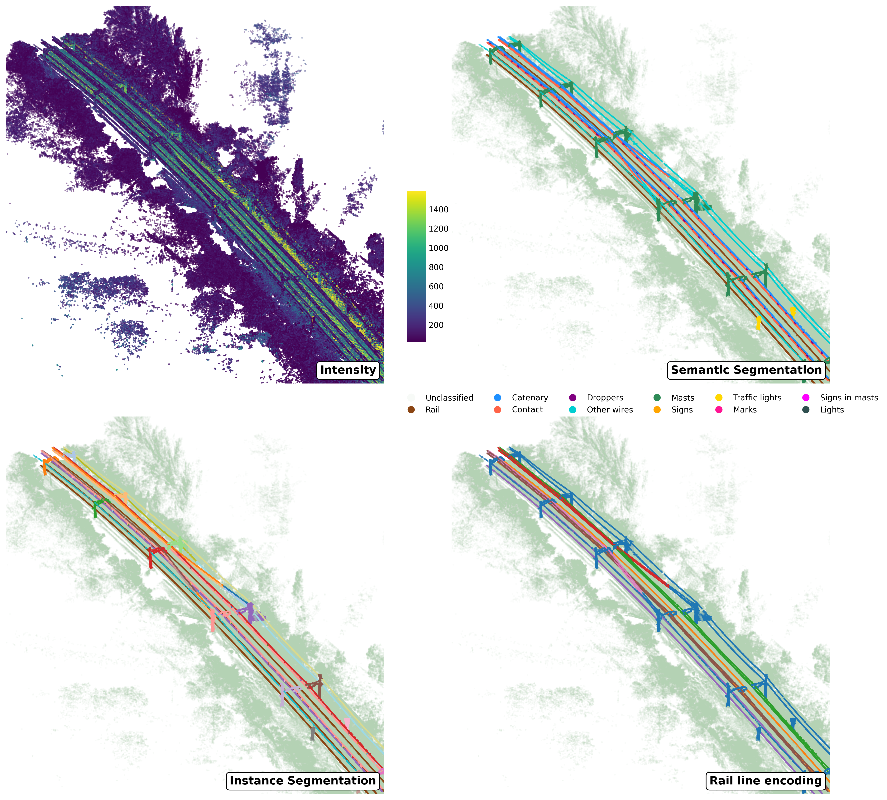

# 📌 SemanticRail3D_Dataset
This repository contains the SemanticRail3D dataset, a high-quality 3D point cloud dataset for railway infrastructure semantic and instance segmentation. It consists of 438 point clouds, each covering 200 meters of track, totaling 2.8 billion points labeled into 11 semantic classes. The dataset is structured for machine learning applications, with train, validation, and test splits.

## ✨ Key Features

- ✔️ **High-resolution LiDAR** (980 pts/m², 5 mm precision)  
- 🧠 **Semantic segmentation** (11 classes) & **Instance segmentation**  
- 📏 Track-position encoding  
- 🧪 Validated for training deep learning models  
- 🔧 Compatible with common point cloud processing libraries


🚀 Use this dataset for developing AI models in railway point cloud analysis! 🚀



## 📖 Introduction

The segmentation and classification of 3D point clouds in railway infrastructures present significant challenges in both scientific research and technological applications. One major difficulty is the limited availability of large, high-quality datasets that enable the training of AI models for point cloud segmentation and classification. Furthermore, the field lacks benchmarks that allow for objective comparison of different approaches, making it difficult to track progress and develop improved solutions.

The SemanticRail3D dataset aims to bridge this gap by offering a comprehensive benchmark for the scientific community. This dataset provides detailed 3D point cloud labels of railway environments, facilitating the development and evaluation of segmentation and classification models. With this dataset, researchers now have a common reference for comparing results, improving methodologies, and advancing state-of-the-art machine learning techniques for railway infrastructure analysis.


## 📊 Dataset Overview

- **438** point clouds (200 m each)  
- **2.8 billion** total points  
- **11 semantic classes**  
- Includes **instance segmentation** and **track position labels**

---

 ## Data Acquisition
The dataset was collected using a LYNX Mobile Mapper by Optech, which employs two LiDAR sensors mounted on a Mobile Mapping System (MMS). The average point cloud density is 980 points/m², with a range precision of 5 mm, ensuring high-quality spatial representation.


## 🧬 Data Attributes

Each point includes the following attributes:

- 📌 `x`, `y`, `z`: Local 3D coordinates (positive-only)  
- 💡 `intensity`: Reflectivity (12-bit, 0–4096)  
- 🕒 `timestamp`: Time of capture  
- 🔁 `return_number`: Order of return (1st, 2nd, etc.)  
- 📶 `num_returns`: Total returns from a pulse  
- 🎯 `scan_angle`: Inclination of the laser at capture

---

# 📦 SemanticRail3D V2: Preprocessed ML-Ready Version
To further support the machine learning community, we introduce SemanticRail3D V2 — a preprocessed and validated version of the original dataset, optimized for deep learning tasks.

### ✅ V2 Enhancements:

- 🔹 **Segmented**: Each 200 m cloud is divided into **5 spatial segments**  
- 🔍 **Validated**: Manual inspection and removal of erroneous segments  
- 🧹 **Cleaned**: Noise reduction and consistent labeling  
- 📁 **Structured Splits**:
  - `train_part1` to `train_part5`  
  - `Validation/`  
  - `Test/`  
- 💾 **Efficient `.laz` storage** with:
  - `x, y, z` coordinates  
  - `intensity`  
  - `class` (semantic label)  
  - `instance_id` (instance label)

### 🔤 File Naming Convention

Each file is named `cloudX_SegY.laz`, where:

- `X` ∈ [0, 437] → 200m point cloud ID  
- `Y` ∈ [1, 5] → Segment index within the point cloud

---

## 📂 Dataset Structure

The dataset is organized as follows:
```plaintext
SemanticRail3D-V2/
                ├── train_part1/
                │   ├── cloudXXX_SegY.laz
                │   ├── cloudXXX_SegY.laz
                │   ├── ...
                ├── train_part2/
                ├── train_part3/
                ├── train_part4/
                ├── train_part5/
                │
                ├── Validation/
                │   ├── cloudXXX_SegY.laz
                │   ├── ...
                │
                ├── Test/
                │   ├── cloudXXX_SegY.laz
                │   ├── ...
```
This tailored version ensures consistency, robustness, and compatibility with point cloud learning frameworks. It is ideal for benchmarking semantic and instance segmentation models in large-scale railway environments.

Each file in the dataset follows the naming pattern cloudX_SegY.laz, where:

✔ X ranges from 0 to 437, indicating the original 200-meter point cloud index

✔ Y ranges from 1 to 5, representing the spatial segment number within each 200-meter stretch

This structured naming makes it easy to trace each segment back to its original scan while enabling fine-grained control during training, validation, and evaluation.


## 📂 Dataset Splits

- 🧪 **[Train Cloud Segments](Data_Info/train_clouds.txt)** → Clouds and their respective segment numbers.
  
- ✅ **[Validation Cloud Segments](Data_Info/val_clouds.txt)** → Clouds and their respective segment numbers.
  
- 🔬 **[Test Cloud Segments](Data_Info/test_clouds.txt)** → Clouds and their respective segment numbers.
  
- 🗑️ **[Removed Cloud Segments](Data_Info/removed_clouds.txt)** → List of removed clouds with missing segments.
  
📊 Dataset Distribution
The dataset consists of 437 point clouds, each divided into 5 segments, totaling 2,185 segments.
Some segments were removed due to issues such as mislabeling, errors in labels, or incorrect class assignments.
The remaining data was split into Train, Validation, and Test sets to be used for machine learning approaches.

📌 Static Chart
Below is the dataset distribution after preprocessing and splitting:


📈 Interactive Chart
For a detailed interactive version, click the link below:

📊 **[View Interactive Chart](Data_Info/dataset_distribution.svg)**


______________________________________________________
📌 Available Attributes per Point in .laz Files

Each `.laz` file contains the following point-wise attributes:

- 📍 `x`, `y`, `z`: 3D coordinates  
- 💡 `intensity`: LiDAR reflectance  
- 🏷️ `class`: Semantic label (0–10)  
- 🔢 `instance_id`: Unique instance identifier

______________________________________________________
## 📌 Semantic Class Distribution (Log Scale)

The dataset contains **11 labeled classes**. Since the class counts vary significantly, we use a **log scale** for better visualization.  
Below, you can see the **exact number of points** in each class.


# 📌 Citation and Related Works for SemanticRail3D Dataset
If you use the SemanticRail3D dataset in your research, please cite it as follows:

### 📌 Citation
The SemanticRail3D dataset is published on Zenodo and can be cited using the following DOI:

🔗 [https://doi.org/10.5281/zenodo.11143766]

This doi will always resolve to the latest version of the dataset. If you want to cite a specific version:

🔗 [https://doi.org/10.5281/zenodo.11143767] SemanticRail3D-v1

The SemanticRail3D-V2 dataset is published on Zenodo and can be cited using the following DOI:

🔗 [https://doi.org/10.5281/zenodo.15641832] SemanticRail3D-v2

```plaintext
@dataset{SemanticRail3D,
  author = {[Soilán, Mario and Ghasemlou, Arshia and Martínez-Sánchez, Joaquín and Pedro, Arias and Lorenzo, Henrique and Riveiro, Belén]},
  title = {SemanticRail3D: A Benchmark Dataset for Railway Infrastructure Segmentation},
  year = {2025},
  version = {v2},
  doi = {10.5281/zenodo.11143766},
  publisher = {Zenodo}
}
```
----------------------

### 📌 Related Works
The SemanticRail3D dataset is derived from and referenced by the following journal articles:

### 📌 Derived From
📄 Journal Article:
Remote Sensing, DOI: 10.3390/rs13122332
Title: Railway Infrastructure Inspection Using Mobile LiDAR and Deep Learning Models

### 📌 Referenced By
📄 Journal Article:
Automation in Construction, DOI: 10.1016/j.autcon.2023.104854
Title: Machine Learning-Based Automated Processing of Railway Point Clouds


